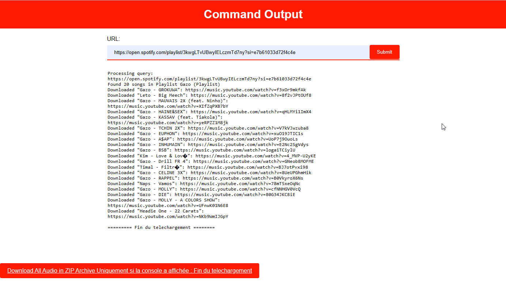
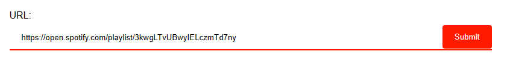
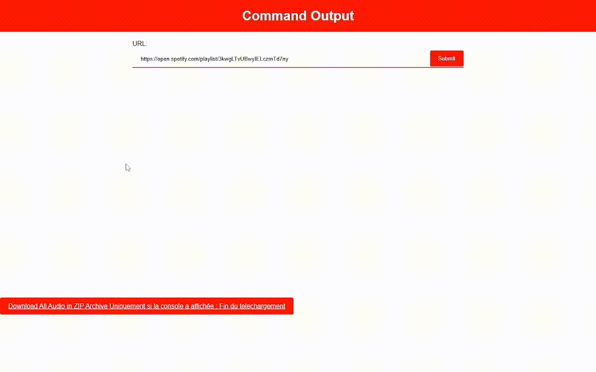

# Application Web de Téléchargement Audio Spotify avec Flask et spotDL
<!-- Spotify-Playlist-Downloader-Web-App-with-Flask-and-spotDL -->

Une application web puissante et conviviale permettant aux utilisateurs de télécharger facilement des contenus audio à partir d'URLs Spotify. Cette application est construite en utilisant Flask pour la gestion du serveur, et spotDL pour le téléchargement asynchrone de fichiers audio.

## Table des matières

- [Aperçu](#aperçu)
- [Fonctionnalités](#fonctionnalités)
- [Captures d'écran](#captures-décran)
- [Prérequis](#prérequis)
- [Installation](#installation)
- [Utilisation](#utilisation)
- [Auteur](#auteur)
- [Avertissement](#avertissement)

## Aperçu

## Fonctionnalités

- Interface web intuitive pour soumettre des URLs Spotify et démarrer les téléchargements.
- Utilisation de spotDL pour le téléchargement asynchrone des fichiers audio.
- Affichage en direct du progrès du téléchargement et de la sortie du processus.
- Possibilité de télécharger tous les fichiers audio en une archive ZIP pratique.

## Captures d'écran

*Interface utilisateur permettant de soumettre des URLs Spotify.*

*Suivi en direct du progrès de téléchargement et de la sortie du processus.*

## Prérequis

- Python 3
- Flask
- spotDL

## Installation

1. Clonez ce dépôt vers votre machine locale en utilisant `git clone https://github.com/Olivier-true/Spotify-Audio-Downloader-Web-App-with-Flask-and-spotDL.git`.
2. Accédez au répertoire du projet : `Spotify-Audio-Downloader-Web-App-with-Flask-and-spotDL`.
3. Installez les dépendances requises en exécutant : `python3 -m pip install -r requirements.txt`.

ou

1. aller sur : https://replit.com/
2. Créez vous un compte si ça n'est pas déjà fait.
3. allez sur : https://replit.com/@glzsql/Spotify-Playlist-Downloader-Web-App
4. Cliquez sur Fork (à droite ou en haut suvant votre appareil) > Fork Repl > Bouton Run > Puis open in new tab (le carré avec la flèche en haut à droite de l'url)

## Utilisation

1. Exécutez l'application en utilisant la commande : `python main.py`.
2. Accédez à l'application depuis votre navigateur en allant sur : `http://localhost:81`.

## Auteur

[Olivier TRUONG](https://github.com/Olivier-true)

## Avertissement

Ce projet est destiné uniquement à des fins éducatives et d'apprentissage. L'objectif principal de ce projet est de mettre en valeur les compétences en programmation et de démontrer l'utilisation de différentes technologies. Les créateurs de ce projet ne soutiennent, n'encouragent ni ne cautionnent toute forme de violation des droits d'auteur ou d'utilisation non autorisée de propriété intellectuelle.

L'utilisation de ce projet pour télécharger du contenu audio à partir de plateformes telles que Spotify et YouTube pourrait potentiellement violer leurs conditions d'utilisation et leurs politiques de droits d'auteur. Les utilisateurs de ce projet sont entièrement responsables de veiller à se conformer à toutes les lois, réglementations et conditions de service pertinentes des plateformes impliquées.

Les créateurs de ce projet déclinent toute responsabilité quant à l'utilisation de ce code ou aux conséquences pouvant découler de son utilisation. Il incombe à chaque utilisateur de comprendre et de se conformer aux directives légales et éthiques applicables lors de l'utilisation de ce projet.

Ce projet ne doit pas être utilisé à des fins commerciales, de violation des droits d'auteur, ni pour toute activité contraire aux politiques des plateformes concernées.

Veuillez utiliser ce projet de manière responsable et respecter les droits des créateurs de contenu et des fournisseurs de plateformes.
