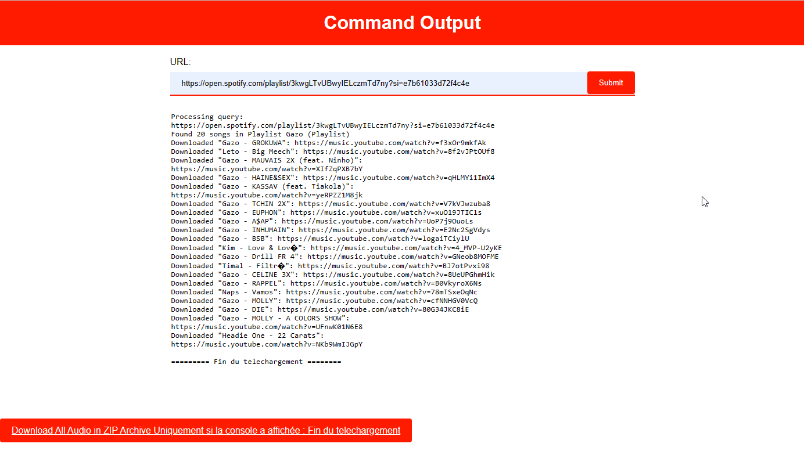

# Spotify Audio Downloader Web App with Flask and spotDL
<!-- Spotify-Playlist-Downloader-Web-App-with-Flask-and-spotDL -->

A powerful and user-friendly web application that allows users to easily download audio content from Spotify URLs. This application is built using Flask for server management and spotDL for asynchronous audio file downloading.

## Table of Contents

- [Overview](#overview)
- [Features](#features)
- [Screenshots](#screenshots)
- [Prerequisites](#prerequisites)
- [Installation](#installation)
- [Usage](#usage)
- [Author](#author)
- [Disclaimer](#disclaimer)

## Overview

## Features

- Intuitive web interface for submitting Spotify URLs and initiating downloads.
- Utilizes spotDL for asynchronous audio file downloading.
- Real-time display of download progress and process output.
- Option to download all audio files in a convenient ZIP archive.

## Screenshots

*User interface allowing submission of Spotify URLs.*

*Live tracking of download progress and process output.*

## Prerequisites

- Python 3
- Flask
- spotDL

## Installation

1. Clone this repository to your local machine using `git clone https://github.com/Olivier-true/Spotify-Audio-Downloader-Web-App-with-Flask-and-spotDL.git`.
2. Navigate to the project directory: `Spotify-Audio-Downloader-Web-App-with-Flask-and-spotDL`.
3. Install the required dependencies by running: `python3 -m pip install -r requirements.txt`.

or

1. Visit: https://replit.com/
2. Create an account if not already done.
3. Go to: https://replit.com/@glzsql/Spotify-Playlist-Downloader-Web-App
4. Click on Fork (right or at the top depending on your device) > Fork Repl > Run Button > Then open in new tab (square with an arrow at the top right of the URL)

## Usage

1. Run the application using the command: `python main.py`.
2. Access the application from your web browser by going to: `http://localhost:81`.

## Author

[Olivier TRUONG](https://github.com/Olivier-true)

## Disclaimer

This project is intended solely for educational and learning purposes. The primary goal of this project is to showcase programming skills and demonstrate the use of various technologies. The creators of this project do not endorse, encourage, or support any form of copyright infringement or unauthorized use of intellectual property.

The use of this project to download audio content from platforms such as Spotify and YouTube may potentially violate their terms of use and copyright policies. Users of this project are solely responsible for ensuring they adhere to all relevant laws, regulations, and terms of service of the platforms involved.

The creators of this project disclaim any responsibility for how this code is used or any consequences that may arise from its use. Each user is responsible for understanding and complying with applicable legal and ethical guidelines when using this project.

This project should not be used for commercial purposes, copyright infringement, or any activity contrary to the policies of the platforms involved.

Please use this project responsibly and respect the rights of content creators and platform providers.
